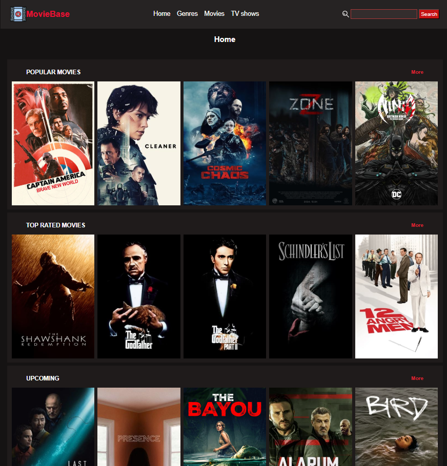
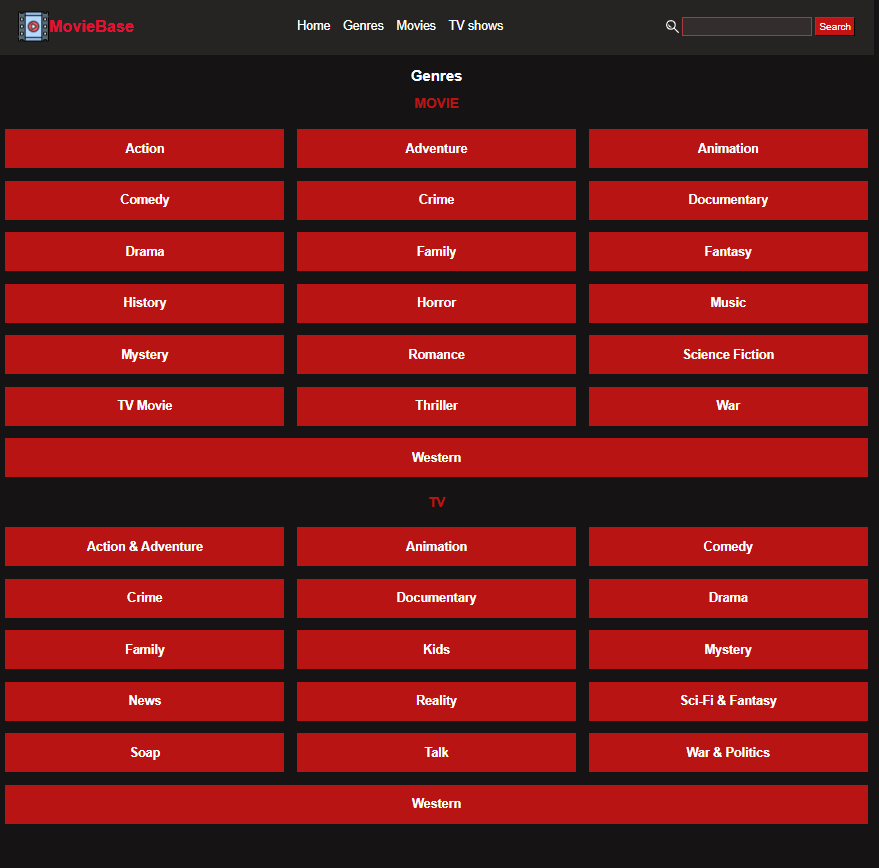
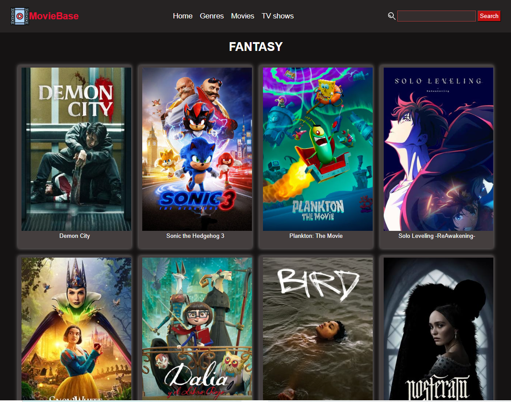
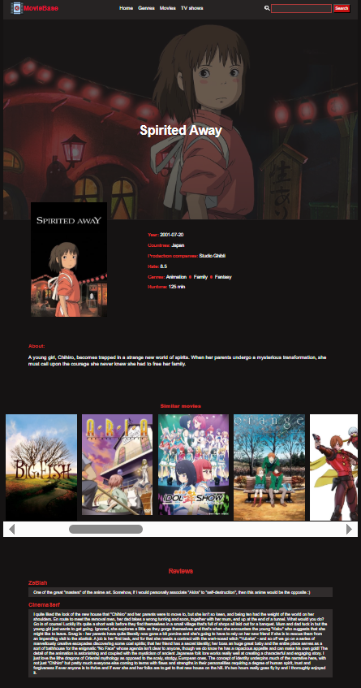
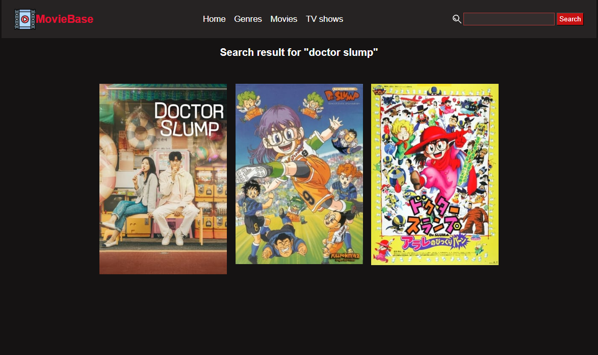

<h1>MovieBase</h1>

<h3>Короткий опис</h3>

Це сайт з фільмами та серіалами, який дозволяє переглянути списки популярних фільмів в різних категоріях та жанрах. Реалізовано за допомогою Vue

<h3>Демо</h3>

<h3>Скріншоти</h3>

<h3>Функціонал</h3>
<ul>
  <li>Головна сторінка
    
Підбірка популярних фільмів та сеіалів

  </li>
  <li>Жанри
    
Список доступних жанрів фільмів та сервалів

    
Картки з назвою та обкладинкою фільму

  </li>
  <li>Сторінка фільму
    
Опис фільму, назва, жанр, країна, обкладинка

    
Підбірка схожих фільмів

    
Можливість переглянути фільми того ж жанру або країни

  </li>
  <li>Пошук
    
Пошук фільиу за назвою

    
  </li>

</ul>

<h3>Як запустити локально</h3>
<ol>
  <li>Склонуйте репозиторій:
    
 <code> git clone https://github.com/LolyaShi/MovieSite.git  </code>

     
<code> cd movies </code>

  </li>
  <li>Встановіть залежності:  
     
<code> npm install vue-router </code>

    
 <code>npm install axios</code>

  </li>
  <li>Запустіть локальний сервер
    
<code> npm run serve </code>

    
  </li>

</ol>

<h3>Використані технології</h3>
<ul>
  <li>Vue</li>
  <li>Використані API:
    
https://api.themoviedb.org

  </li>
</ul>
